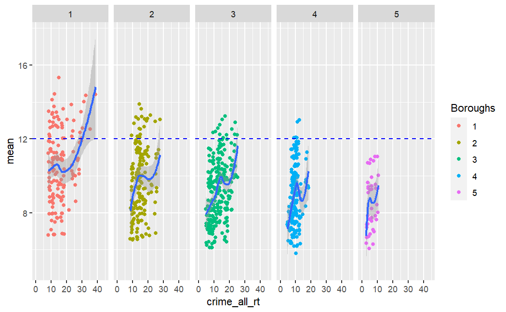

# Portfolio

### Education
Math, BS | University of Massachusetts Amherst

Data Analytics & Computational Social Sciences, MS | University of Massachusetts Amherst

### Relevant Coursework
GIS/Remote Sensing (Spatial Analytics using Python), Time Series Analysis, Statistical Computing (Web Query & Scraping/Data Mining/Data Wrangling/Analysis), Regression Analysis (Predictive Analytics), Data Visualization, Probability, Discrete Structures, Scientific Computing, Programming with Data Structures

### Work Experience
Business Intelligence Analyst @ PGIM Fixed Income
- Automated processes/workflows used in the analysis of regularly updated data housed in several Tableau servers in order to identify trends and changes
- Performed ETL functions to prepare data for use in Tableau to develop dashboards, visualizations and reports.
- Worked in a scrum environment - organized projects using Agile methodology in Jira
- Wrote standard operating procedures providing guidance on data governance, management and use in Tableau and Power BI

Data Science Researcher @ World Data Science Institute
- Developed CryptoShare
- Created course materials based on blockchain technology [Blockchain Simply Explained](https://github.com/5secondmemory/Portfolio/blob/main/Projects/Project%2020%20-%20Blockchain%20Simply%20Explained.pdf)

Database Management @ Cogentiv Solutions
- Used Microsoft Excel and SQL to maintain and develop a database on carbon capture & utilization projects globally

### Skills
Proficient in ArcGIS, R, Tidyverse, R Shiny, Tableau, MS Office, Agile, Jira, Confluence, Power BI, Python, and SQL. Experienced in LaTeX, MATLAB, Java, C#, GCP App Engine, Flask, Django, Jupyter Notebooks and Scala. 

### Projects
[Air Quality in Marginalized Communities](https://github.com/5secondmemory/Portfolio/blob/main/Projects/Air%20Quality%20in%20Marginalized%20Communities.pdf)

[Air Quality in Marginalized Communities - Philadelphia](https://github.com/5secondmemory/Portfolio/blob/main/Projects/Air%20Quality%20in%20Marginalized%20Communities%20-%20Philadelphia%20edition.pdf)

[Lake Meade Water Levels](https://github.com/5secondmemory/Portfolio/blob/main/Projects/GIS%20Poster.pdf)

